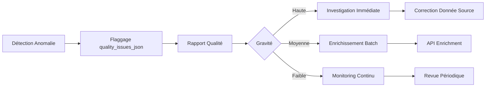

# Cahier de Qualité - OpenFoodFacts Datamart

## 1. Stratégie de Qualité des Données

La qualité des données est assurée à chaque étape du pipeline ETL (Bronze → Silver → Gold).
Nous appliquons une stratégie de **"Filter & Flag"** :
- ✅ Nous ne rejetons pas silencieusement les lignes sauf si elles sont inexploitables (pas de code-barres)
- ✅ Nous marquons les problèmes de qualité via `quality_issues_json` et `completeness_score`
- ✅ Nous générons des rapports détaillés pour audit et remédiation
- ✅ Nous suivons l'évolution de la qualité dans le temps

### Principes Directeurs

1. **Traçabilité:** Chaque anomalie est documentée et traçable
2. **Non-rejet:** Maximiser l'ingestion, marquer les problèmes
3. **Mesurabilité:** Métriques quantifiables à chaque étape
4. **Amélioration Continue:** Suivi temporel des indicateurs qualité

---

## 2. Règles de Nettoyage (Silver Layer)

### 2.1 Normalisation des Chaînes

| Règle | Description | Exemple |
|-------|-------------|---------|
| **Trimming** | Suppression espaces début/fin | `" Nutella "` → `"Nutella"` |
| **Casse** | Normalisation minuscules pour scores | `"E"` → `"e"` (nutriscore_grade) |
| **Préfixes langue** | Suppression préfixes tags | `"en:breakfast"` → `"breakfast"` |

**Code:**
```python
df = normalize_tags(df, "categories_tags", "categories_normalized")
```

### 2.2 Conversion d'Unités

| Conversion | Formule | Cas d'Usage |
|------------|---------|-------------|
| **Sel ↔ Sodium** | `salt (g) = sodium (g) × 2.5` | Si salt manquant mais sodium présent |
| **kJ → kcal** | `kcal = kJ ÷ 4.184` | Si energy_kcal manquant (non implémenté v1.0) |

**Implémentation:**
```python
df = df.withColumn("salt_100g",
    F.coalesce(F.col("salt_100g"), F.col("sodium_100g") * 2.5))
```

### 2.3 Résolution Multilingue

Priorité pour les noms de produits: **Français > Anglais > Générique > Fallback**

```python
F.coalesce(
    F.col("product_name_fr"),
    F.col("product_name_en"),
    F.col("product_name"),
    F.col("generic_name"),
    F.lit("Unknown Product")
)
```

### 2.4 Dédoublonnage

**Critère:** Unicité sur `code` (code-barres EAN-13)

**Règle:** En cas de doublon, conserver l'enregistrement avec le `last_modified_t` le plus récent

**Implémentation:**
```python
window = Window.partitionBy("code").orderBy(F.col("last_modified_t").desc())
df = df.withColumn("_rn", F.row_number().over(window))
       .filter(F.col("_rn") == 1)
       .drop("_rn")
```

**Métrique:** Nombre de doublons supprimés reporté dans les logs

---

## 3. Règles de Validation

### 3.1 Validation de Bornes

Valeurs nutritionnelles pour 100g doivent être dans des intervalles réalistes:

| Nutriment | Min | Max | Unité | Justification |
|-----------|-----|-----|-------|---------------|
| `energy_kcal_100g` | 0 | 900 | kcal | Max = huiles pures (~900 kcal) |
| `sugars_100g` | 0 | 100 | g | Impossible > 100g/100g |
| `fat_100g` | 0 | 100 | g | Impossible > 100g/100g |
| `saturated_fat_100g` | 0 | 100 | g | Sous-ensemble de fat_100g |
| `salt_100g` | 0 | 25 | g | Sel extrêmement élevé au-delà |
| `sodium_100g` | 0 | 10 | g | Correspondance avec salt |
| `proteins_100g` | 0 | 100 | g | Max = poudres protéinées pures |
| `fiber_100g` | 0 | 100 | g | Max = suppléments de fibres |

**Action:** Flaggage dans colonne `<nutriment>_out_of_bounds` (booléen)

### 3.2 Validation de Cohérence

| Règle | Description | Seuil |
|-------|-------------|-------|
| **Énergie négative** | `energy_kcal_100g < 0` | Anomalie |
| **Gras saturés > Gras total** | `saturated_fat_100g > fat_100g` | Incohérent |
| **Sodium sans sel** | `sodium_100g present` ET `salt_100g absent` | Convertir |

### 3.3 Validation Référentielle

| Champ | Règle | Action |
|-------|-------|--------|
| `code` | Non NULL, format EAN-8/13 | Rejet si NULL |
| `brands` | Doit exister dans `dim_brand` | Créer si nouveau |
| `categories` | Au moins 1 catégorie valide | Flag si absent |

---

## 4. Score de Complétude

### 4.1 Méthodologie

Score pondéré basé sur la présence de champs clés:

**Formule:**
```
completeness_score = Σ (poids_i × présence_i)
  où présence_i = 1 si champ non NULL, 0 sinon
```

### 4.2 Pondération des Champs

| Champ | Poids | Justification |
|-------|-------|---------------|
| `product_name` | 20% | Essentiel pour identification |
| `brands` | 15% | Important pour analyses marques |
| `categories` | 15% | Important pour segmentation |
| `nutriscore_grade` | 10% | KPI qualité nutritionnelle |
| `energy_kcal_100g` | 10% | Nutriment fondamental |
| `sugars_100g` | 7.5% | Nutriment surveillé (santé) |
| `fat_100g` | 7.5% | Nutriment surveillé (santé) |
| `saturated_fat_100g` | 5% | Détail du fat |
| `salt_100g` | 5% | Nutriment surveillé (santé) |
| `proteins_100g` | 7.5% | Nutriment important |
| `fiber_100g` | 5% | Nutriment secondaire |
| **Total** | **100%** | |

### 4.3 Interprétation du Score

| Score | Catégorie | Action Recommandée |
|-------|-----------|-------------------|
| 0.80 - 1.00 | 🟢 Haute qualité | Aucune action |
| 0.50 - 0.79 | 🟡 Qualité moyenne | Enrichissement souhaitable |
| 0.00 - 0.49 | 🔴 Faible qualité | Enrichissement prioritaire |

### 4.4 Implémentation

```python
from etl.utils import compute_completeness_score
from etl.settings import QUALITY_RULES

weights = QUALITY_RULES["completeness_weights"]
df = compute_completeness_score(df, weights)
```

---

## 5. Métriques Suivies

Le job `etl/jobs/quality_report.py` génère un rapport JSON avec les métriques suivantes:

### 5.1 Métriques de Complétude

| Métrique | Description | Seuil d'Alerte |
|----------|-------------|----------------|
| **Overall Avg Score** | Score moyen de complétude | < 0.50 |
| **Field-level Completeness** | % non-NULL par champ | < 30% pour champs clés |
| **High Quality Products** | Nb produits avec score ≥ 0.8 | Trend à surveiller |
| **Low Quality Products** | Nb produits avec score < 0.5 | > 20% du total |

### 5.2 Métriques d'Anomalies

| Métrique | Description | Seuil d'Alerte |
|----------|-------------|----------------|
| **Out of Bounds Count** | Nb valeurs hors bornes par nutriment | > 100 |
| **Negative Values** | Nb valeurs négatives | > 0 |
| **Extreme Values** | Valeurs extrêmes mais techniquement possibles | À investiguer |
| **Anomaly Rate** | % produits avec au moins 1 anomalie | > 5% |

### 5.3 Métriques de Distribution

| Métrique | Description | Usage |
|----------|-------------|-------|
| **Nutri-Score Distribution** | Répartition grades A-E | Profil nutritionnel global |
| **Completeness Distribution** | Répartition High/Medium/Low | Vue d'ensemble qualité |
| **NOVA Distribution** | Répartition groupes 1-4 | Niveau transformation |

### 5.4 Métriques Temporelles

| Métrique | Description | Périodicité |
|----------|-------------|-------------|
| **Weekly Completeness Trend** | Évolution score par semaine | Hebdomadaire |
| **Anomaly Trend** | Évolution nombre anomalies | Hebdomadaire |
| **New Products Quality** | Qualité des produits récents | Par run ETL |

---

## 6. Rapports de Qualité

### 6.1 Rapport Automatique (JSON)

Généré à chaque run ETL dans `data/quality_reports/quality_report_<timestamp>.json`

**Structure:**
```json
{
  "timestamp": "2024-01-23T10:30:00",
  "total_records": 150000,
  "completeness_metrics": {
    "overall_avg_score": 0.73,
    "product_name": {"completeness_pct": 98.5},
    "nutriscore_grade": {"completeness_pct": 65.2}
  },
  "anomalies": {
    "sugars_100g": {
      "count": 23,
      "examples": [...]
    }
  },
  "alerts": [
    {"type": "high_anomalies", "severity": "warning"}
  ]
}
```

### 6.2 Rapport SQL

Requêtes prédéfinies dans `sql/analysis_queries.sql`:

- **Requête 4:** Taux de complétude par marque
- **Requête 5:** Liste des anomalies détectées
- **Requête 6:** Évolution hebdomadaire de la complétude
- **Requête 10:** Produits récents à faible complétude

### 6.3 Dashboard (Extension Recommandée)

Pour visualisation temps réel, considérer:
- Grafana + MySQL
- Tableau / Power BI
- Jupyter Dashboard avec plotly

---

## 7. Anomalies et Gestion

### 7.1 Types d'Anomalies

| Type | Détection | Gravité | Action |
|------|-----------|---------|--------|
| **Valeur hors bornes** | Check automatique bounds | 🔴 Haute | Flag + Report |
| **Valeur manquante critique** | Champ requis NULL | 🟡 Moyenne | Flag complétude |
| **Incohérence logique** | Ex: saturated > total fat | 🔴 Haute | Investigation |
| **Format invalide** | Ex: code-barres mal formé | 🔴 Haute | Rejet Bronze |

### 7.2 Workflow de Remédiation



### 7.3 Exemples d'Anomalies Réelles

**Cas 1: Sucres > 100g**
```
Code: 3245678901234
Product: "Sucre en poudre"
Issue: sugars_100g = 99.9
Action: Acceptable (produit = 100% sucre)
```

**Cas 2: Énergie Incohérente**
```
Code: 1234567890123
Product: "Eau minérale"
Issue: energy_kcal_100g = 450
Action: Anomalie vraie, corriger source
```

### 7.4 Stockage des Anomalies

**Table de faits:**
```sql
SELECT code, product_name, quality_issues_json
FROM fact_nutrition_snapshot f
JOIN dim_product p ON f.product_sk = p.product_sk
WHERE quality_issues_json != '{}';
```

**Format JSON:**
```json
{
  "energy_kcal_100g": false,
  "sugars_100g": true,
  "fat_100g": false,
  "salt_100g": true
}
```

---

## 8. Plan d'Amélioration Continue

### 8.1 Améliorations Court Terme (v1.1)

- [ ] Validation format code-barres (regex EAN-13)
- [ ] Détection outliers statistiques (IQR)
- [ ] Enrichissement via API OFF pour champs manquants
- [ ] Alertes email si seuils dépassés

### 8.2 Améliorations Moyen Terme (v1.5)

- [ ] Machine Learning pour détection anomalies avancées
- [ ] Résolution taxonomies (catégories hiérarchiques)
- [ ] Tracking qualité par contributeur OFF
- [ ] Dashboard temps réel Grafana

### 8.3 Améliorations Long Terme (v2.0)

- [ ] Data lineage complet (provenance)
- [ ] Versioning des règles qualité
- [ ] A/B testing des règles de nettoyage
- [ ] Feedback loop vers OpenFoodFacts

---

## 9. Audit et Conformité

### 9.1 Traçabilité

Chaque run ETL génère:
- ✅ Métadonnées dans `data/run_metadata.json`
- ✅ Rapport qualité horodaté
- ✅ Logs détaillés par job
- ✅ Snapshots de données dans Data Lake

### 9.2 Reproductibilité

Le pipeline est entièrement reproductible:
```bash
# Re-run avec mêmes données d'entrée produit mêmes résultats
python -m etl.main tests/sample_data.jsonl
```

### 9.3 Documentation

- ✅ Code source documenté (docstrings)
- ✅ Tests unitaires pour règles qualité
- ✅ Ce cahier de qualité
- ✅ Data dictionary complet

---

## 10. Références

### Standards Appliqués

- **ISO 8000:** Data Quality Standards
- **DAMA-DMBOK:** Data Management Body of Knowledge
- **OpenFoodFacts Guidelines:** https://world.openfoodfacts.org/data

### Bibliographie

- OpenFoodFacts Data Quality Rules: https://wiki.openfoodfacts.org/Data_quality
- Nutri-Score Computation: https://www.santepubliquefrance.fr/nutri-score
- NOVA Classification: https://archive.wphna.org/wp-content/uploads/2016/01/WN-2016-7-1-3-28-38-Monteiro-Cannon-Levy-et-al-NOVA.pdf

---

**Version:** 1.0.0
**Dernière mise à jour:** 2024-01-23
**Responsable Qualité:** Équipe M1 EISI/CDPIA/CYBER
