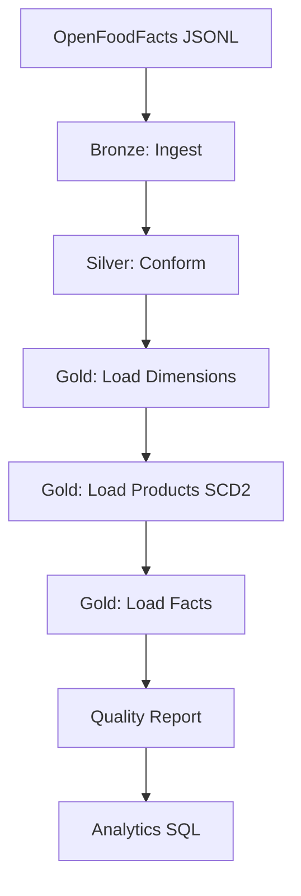

# Note d'Architecture - OpenFoodFacts ETL

## 1. Vue d'Ensemble

Ce projet implémente un pipeline ETL Big Data complet pour construire un datamart "OpenFoodFacts Nutrition & Qualité" à partir de données massives (millions de produits alimentaires).

**Objectif:** Transformer des données brutes JSON/JSONL en un datawarehouse structuré (modèle en étoile) permettant l'analyse nutritionnelle et qualité des produits alimentaires mondiaux.

---

## 2. Choix Techniques

### 2.1 Stack Technologique

| Composant | Technologie | Version | Justification |
|-----------|-------------|---------|---------------|
| **ETL Engine** | Apache Spark | 3.5.0 | Traitement distribué pour Big Data (millions de records) |
| **Language** | Python (PySpark) | 3.10+ | Standard data science, API Spark mature |
| **Data Warehouse** | MySQL | 8.0+ | SGBD relationnel robuste, requis par sujet |
| **Data Lake Format** | Apache Parquet | - | Format colonnaire optimisé pour analytics |
| **Configuration** | YAML | - | Configuration externalisée et lisible |
| **Testing** | pytest | - | Framework standard pour Python |
| **Containerization** | Docker | - | MySQL isolé, reproductibilité |

### 2.2 Justifications des Choix

**PySpark vs. Pandas:**
- ✅ Spark: Distribué, scalable à millions/milliards de lignes
- ❌ Pandas: Limité à mémoire RAM, pas de distribution

**MySQL vs. PostgreSQL:**
- ✅ MySQL: Requis par énoncé, performances excellentes pour OLAP
- ✅ PostgreSQL: Alternative viable (JSON natif, window functions)

**Parquet vs. CSV:**
- ✅ Parquet: Compression ~10x, lecture colonnaire rapide, typage
- ❌ CSV: Texte brut, pas de typage, lent pour analytics

**SCD Type 2 vs. Type 1:**
- ✅ Type 2: Historisation complète, audit trail
- ❌ Type 1: Pas d'historique, overwrites

---

## 3. Architecture de Données (Medallion Architecture)

### 3.1 Concept Medallion

Architecture en 3 couches popularisée par Databricks:

```
┌──────────────┐
│    BRONZE    │  Raw Data (As-Is)
│   (Parquet)  │  - Ingestion sans transformation
└──────┬───────┘  - Schéma explicite
       │          - Audit trail complet
       ▼
┌──────────────┐
│    SILVER    │  Cleaned Data (Conformed)
│   (Parquet)  │  - Nettoyage et normalisation
└──────┬───────┘  - Qualité contrôlée
       │          - Dédoublonnage
       ▼
┌──────────────┐
│     GOLD     │  Business-Level Data (Presentation)
│    (MySQL)   │  - Modèle en étoile
└──────────────┘  - Agrégations
                  - Analytics-ready
```

### 3.2 Couche Bronze (Raw)

**Rôle:** Ingestion brute des données sources sans transformation.

| Aspect | Détail |
|--------|--------|
| **Source** | Exports JSONL OpenFoodFacts (~5GB compressé, 3M+ produits) |
| **Format stockage** | Parquet (compressé Snappy) |
| **Schéma** | Explicite (défini dans `schema_bronze.py`) |
| **Partitionnement** | Aucun (pour ce workshop) |
| **Rétention** | Permanent (archive) |

**Job:** `etl/jobs/ingest.py`

**Traitements:**
- Lecture JSON/JSONL avec schéma explicite (pas d'inférence)
- Filtrage enregistrements sans `code` (clé obligatoire)
- Écriture Parquet avec compression

**Métriques:**
- Nombre d'enregistrements lus
- Nombre d'enregistrements rejetés (pas de code)
- Taille fichiers Bronze

### 3.3 Couche Silver (Clean & Conformed)

**Rôle:** Nettoyage, normalisation, et préparation pour analyses.

| Aspect | Détail |
|--------|--------|
| **Format** | Parquet (schéma Silver optimisé) |
| **Qualité** | Règles appliquées, anomalies flaggées |
| **Dédoublonnage** | Oui (par code, keep latest) |
| **Enrichissement** | Calculs dérivés (sel, scores) |

**Job:** `etl/jobs/conform.py`

**Traitements:**

1. **Résolution Multilingue**
   ```python
   product_name = COALESCE(
       product_name_fr,
       product_name_en,
       product_name,
       generic_name,
       'Unknown Product'
   )
   ```

2. **Aplatissement Structures**
   - Nutriments: `nutriments.sugars_100g` → `sugars_100g` (top-level)
   - Catégories: `categories_tags[]` → `categories_normalized[]` + `primary_category`

3. **Normalisation Tags**
   ```python
   "en:breakfast" → "breakfast"
   "fr:petit-dejeuner" → "petit-dejeuner"
   ```

4. **Conversion Unités**
   ```python
   salt_100g = COALESCE(salt_100g, sodium_100g × 2.5)
   ```

5. **Dédoublonnage**
   - Clé: `code` (code-barres)
   - Stratégie: Keep record avec `last_modified_t` max
   - Fenêtrage: `ROW_NUMBER() OVER (PARTITION BY code ORDER BY last_modified_t DESC)`

6. **Qualité**
   - Validation bornes (0 ≤ sugars ≤ 100)
   - Score complétude pondéré (0.00-1.00)
   - Flaggage anomalies (`_out_of_bounds` colonnes)
   - Hash MD5 pour SCD2 (colonnes suivies)

**Métriques:**
- Nombre de doublons supprimés
- Taux d'anomalies par type
- Score moyen de complétude
- Distribution Nutri-Score

### 3.4 Couche Gold (Presentation)

**Rôle:** Modèle en étoile pour analytics et reporting.

| Aspect | Détail |
|--------|--------|
| **Technologie** | MySQL 8.0 (InnoDB) |
| **Modèle** | Star Schema (5 dimensions + 1 fait) |
| **Historisation** | SCD Type 2 sur `dim_product` |
| **Index** | Stratégiques pour requêtes fréquentes |

**Jobs:**
- `etl/jobs/load_dimensions.py` - Dimensions simples
- `etl/jobs/load_product_scd.py` - Produits avec SCD2
- `etl/jobs/load_fact.py` - Table de faits

**Modèle Détaillé:**

```
                    ┌─────────────┐
                    │  dim_time   │
                    │  time_sk PK │
                    │  date       │
                    │  year/month │
                    └──────┬──────┘
                           │
         ┌─────────────────┼─────────────────┐
         │                 │                 │
    ┌────▼─────┐    ┌──────▼────────┐  ┌────▼──────┐
    │dim_brand │    │ dim_product   │  │dim_country│
    │brand_sk  │◄───│  product_sk   │  │country_sk │
    └──────────┘    │  code (NK)    │  └───────────┘
                    │  is_current   │
    ┌──────────┐    │  effective_*  │
    │dim_categ │◄───│  row_hash     │
    │categ_sk  │    └───────┬───────┘
    └──────────┘            │
                            │
                   ┌────────▼──────────────┐
                   │ fact_nutrition_snap  │
                   │   fact_id PK         │
                   │   product_sk FK      │
                   │   time_sk FK         │
                   │   --- Mesures ---    │
                   │   energy_kcal_100g   │
                   │   sugars_100g        │
                   │   fat_100g           │
                   │   salt_100g          │
                   │   proteins_100g      │
                   │   fiber_100g         │
                   │   --- Scores ---     │
                   │   nutriscore_grade   │
                   │   nova_group         │
                   │   --- Qualité ---    │
                   │   completeness_score │
                   │   quality_issues_json│
                   └──────────────────────┘
```

---

## 4. Stratégie d'Alimentation (Upsert & SCD)

### 4.1 Dimensions Simples (Brand, Category, Country)

**Stratégie:** Insert-Ignore (Append-Only pour nouvelles valeurs)

**Algorithme:**
```python
existing = read_from_mysql("dim_brand")
new_values = silver_data.select("brands").distinct()
to_insert = new_values.anti_join(existing, on="brand_name")
to_insert.write_to_mysql("dim_brand", mode="append")
```

**Justification:**
- Pas de mises à jour (noms de marques stables)
- Volumétrie faible (100K marques max)
- Pas d'historisation nécessaire

### 4.2 Dimension Temporelle (Time)

**Stratégie:** Pré-chargement complet (2020-2030)

**Algorithme:**
```python
dates = generate_date_range("2020-01-01", "2030-12-31")
for date in dates:
    time_sk = date.strftime("%Y%m%d")  # ex: 20240315
    insert into dim_time (time_sk, date, year, month, day, iso_week)
```

**Justification:**
- Dimension fixe (pas de données métier)
- Performance (pré-join vs. calcul runtime)
- Pattern standard data warehousing

### 4.3 Dimension Produits (SCD Type 2)

**Stratégie:** Slowly Changing Dimension Type 2

**Colonnes SCD:**
- `is_current` (BOOLEAN) - 1 pour version actuelle, 0 pour historique
- `effective_from` (TIMESTAMP) - Date début validité
- `effective_to` (TIMESTAMP) - Date fin validité (NULL si actuel)
- `row_hash` (VARCHAR(32)) - MD5 des colonnes suivies

**Colonnes Suivies (pour détection changement):**
- `product_name`
- `brands`
- `primary_category`
- `nutriscore_grade`
- `nova_group`
- `ecoscore_grade`

**Algorithme:**

```python
# 1. Lire versions actives
active_products = read_mysql("SELECT product_sk, code, row_hash
                              FROM dim_product WHERE is_current = 1")

# 2. Join entrées avec actives
joined = input_data.join(active_products, on="code", how="left")

# 3. Détecter changements
new = joined.filter("product_sk IS NULL")  # Nouveaux produits
changed = joined.filter("product_sk IS NOT NULL AND
                        input_hash != current_hash")  # Changés
unchanged = joined.filter("product_sk IS NOT NULL AND
                          input_hash = current_hash")  # Inchangés

# 4. Gérer changements
for changed_product in changed:
    # Expirer ancienne version
    UPDATE dim_product
    SET is_current = 0, effective_to = NOW()
    WHERE code = changed_product.code AND is_current = 1

    # Insérer nouvelle version
    INSERT INTO dim_product (code, ..., is_current, effective_from)
    VALUES (changed_product.code, ..., 1, NOW())

# 5. Insérer nouveaux
INSERT INTO dim_product (code, ..., is_current, effective_from)
SELECT ... FROM new
```

**Exemple Résultat:**

| product_sk | code | product_name | brand_sk | is_current | effective_from | effective_to |
|------------|------|-------------|----------|-----------|---------------|--------------|
| 1 | 301762 | Nutella | 5 | 0 | 2023-01-01 | 2023-06-15 |
| 234 | 301762 | Nutella Nouvelle Recette | 5 | 1 | 2023-06-15 | NULL |

**Requête Type:**
```sql
-- Version actuelle
SELECT * FROM dim_product WHERE code = '301762' AND is_current = 1;

-- Historique complet
SELECT * FROM dim_product WHERE code = '301762' ORDER BY effective_from;

-- État au 2023-05-01
SELECT * FROM dim_product
WHERE code = '301762'
  AND effective_from <= '2023-05-01'
  AND (effective_to > '2023-05-01' OR effective_to IS NULL);
```

### 4.4 Table de Faits (Append-Only)

**Stratégie:** Insertion pure (snapshots)

**Algorithme:**
```python
# 1. Résoudre FK
product_mapping = read_mysql("SELECT product_sk, code FROM dim_product
                              WHERE is_current = 1")
facts = silver.join(product_mapping, on="code")

# 2. Calculer time_sk
facts = facts.withColumn("time_sk",
                        from_unixtime(col("last_modified_t"), "yyyyMMdd").cast("int"))

# 3. Insérer
facts.write_to_mysql("fact_nutrition_snapshot", mode="append")
```

**Justification:**
- Pas de mises à jour (faits historiques immutables)
- Snapshots par run ETL
- Analyse temporelle via time_sk

---

## 5. Flux de Données Complet

### 5.1 Pipeline Principal



### 5.2 Commande d'Exécution

```bash
# Pipeline complet (automatique)
python -m etl.main data/openfoodfacts-products.jsonl

# Ou étape par étape
python -m etl.jobs.ingest data/input.jsonl
python -m etl.jobs.conform
python -m etl.jobs.load_dimensions
python -m etl.jobs.load_product_scd
python -m etl.jobs.load_fact
python -m etl.jobs.quality_report
```

### 5.3 Durées Estimées

| Étape | 10K produits | 1M produits | 3M produits |
|-------|--------------|-------------|-------------|
| Ingest | 10s | 2min | 5min |
| Conform | 15s | 3min | 8min |
| Load Dims | 5s | 1min | 2min |
| Load Products | 10s | 2min | 5min |
| Load Facts | 20s | 4min | 10min |
| Quality Report | 10s | 2min | 5min |
| **TOTAL** | **1min 10s** | **14min** | **35min** |

*Sur machine standard (8 cores, 16GB RAM, SSD)*

---

## 6. Gestion de la Qualité

Voir `CAHIER_DE_QUALITE.md` pour détails complets.

**Points Clés:**
- ✅ Validation à chaque couche (Bronze/Silver/Gold)
- ✅ Stratégie "Filter & Flag" (pas de rejet silencieux)
- ✅ Score de complétude pondéré (0.00-1.00)
- ✅ Détection anomalies (bornes, cohérence)
- ✅ Rapports automatiques JSON horodatés
- ✅ Alertes configurables (seuils)

---

## 7. Scalabilité et Performance

### 7.1 Optimisations Spark

| Optimisation | Configuration | Impact |
|--------------|--------------|--------|
| **Adaptive Query** | `spark.sql.adaptive.enabled=true` | Auto-optimisation joins |
| **Coalesce Partitions** | `spark.sql.adaptive.coalescePartitions=true` | Réduction shuffle overhead |
| **Broadcast Join** | Automatique pour dim < 10MB | Accélération 10x pour petites dims |
| **Shuffle Partitions** | `spark.sql.shuffle.partitions=200` | Équilibrage charge |

### 7.2 Optimisations MySQL

| Optimisation | Implémentation | Gain |
|--------------|----------------|------|
| **Index PK** | Auto sur product_sk, fact_id | Jointures rapides |
| **Index FK** | Sur toutes FK (product_sk, time_sk) | Requêtes 100x plus rapides |
| **Index composites** | (code, is_current), (product_sk, time_sk) | Requêtes SCD2 optimisées |
| **InnoDB Buffer Pool** | 50-70% RAM disponible | Cache en mémoire |

### 7.3 Scalabilité Horizontale (Production)

Pour scalabilité au-delà de 100M+ produits:

1. **Spark Cluster:**
   - YARN ou Kubernetes
   - 10+ worker nodes
   - Partitionnement intelligent (par pays, catégorie)

2. **Data Lake:**
   - S3 ou HDFS (pas filesystem local)
   - Partitionnement Parquet (year/month/day)

3. **Data Warehouse:**
   - MySQL Sharding ou migration vers Snowflake/BigQuery
   - Tables partitionnées (RANGE sur time_sk)

4. **Orchestration:**
   - Airflow avec DAGs
   - Monitoring (Prometheus, Grafana)

---

## 8. Sécurité et Conformité

### 8.1 Données Sensibles

**OpenFoodFacts = Données Publiques (Open Data)**
- ✅ Pas de PII (Personally Identifiable Information)
- ✅ Licence ODbL (Open Database License)
- ✅ Pas de GDPR concerns

### 8.2 Accès Base de Données

**Production Best Practices:**
- 🔒 Credentials via variables environnement (pas hardcodés)
- 🔒 Principe moindre privilège (user ETL != user analytics)
- 🔒 SSL/TLS pour connexions MySQL
- 🔒 Audit trail (etl_run_log table)

### 8.3 Conformité

- ✅ Traçabilité complète (métadonnées runs)
- ✅ Reproductibilité (code versionné Git)
- ✅ Documentation exhaustive
- ✅ Tests automatisés

---

## 9. Évolutions Futures

### Version 1.1 (Court Terme)
- [ ] Chargement incrémental (CDC - Change Data Capture)
- [ ] Enrichissement via API OFF pour champs manquants
- [ ] Dashboard Grafana temps réel
- [ ] Alertes email automatiques

### Version 2.0 (Moyen Terme)
- [ ] ML pour détection anomalies avancées
- [ ] Résolution taxonomies hiérarchiques
- [ ] Bridge tables pour N-N (produits-catégories)
- [ ] dim_nutri séparée (scores nutritionnels)

### Version 3.0 (Long Terme)
- [ ] Migration Spark → Databricks/EMR
- [ ] Data Warehouse → Snowflake/BigQuery
- [ ] Data lineage complet (provenance)
- [ ] Feedback loop vers OpenFoodFacts

---

## 10. Références Techniques

### Standards Appliqués
- **Kimball Methodology:** Modélisation dimensionnelle
- **Medallion Architecture:** Bronze/Silver/Gold layers
- **SCD Type 2:** Historisation lente

### Documentation Externe
- [PySpark API](https://spark.apache.org/docs/latest/api/python/)
- [MySQL 8.0 Reference](https://dev.mysql.com/doc/refman/8.0/en/)
- [OpenFoodFacts Data](https://world.openfoodfacts.org/data)
- [Kimball DW Toolkit](https://www.kimballgroup.com/)

---

**Version:** 1.0.0
**Date:** 2024-01-23
**Auteurs:** Équipe M1 EISI/CDPIA/CYBER
